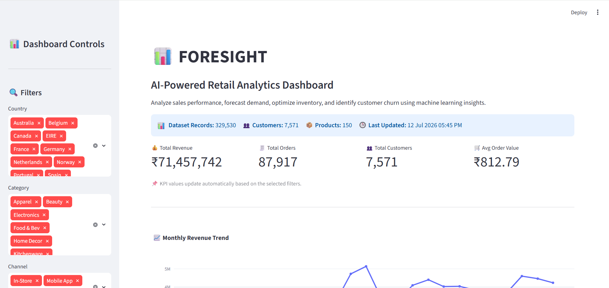
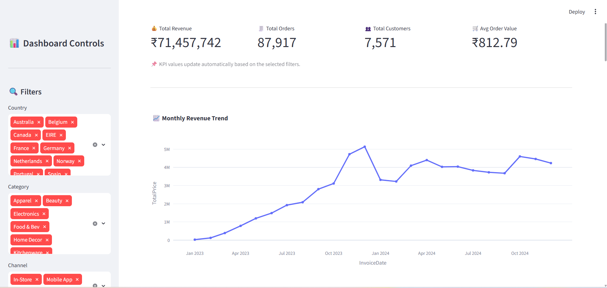
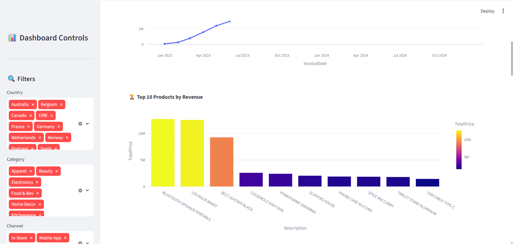
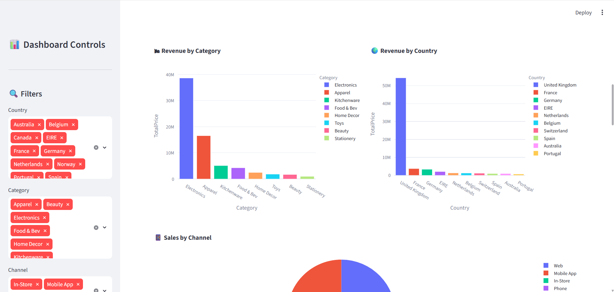
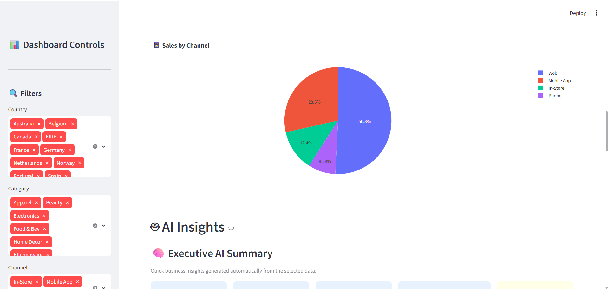
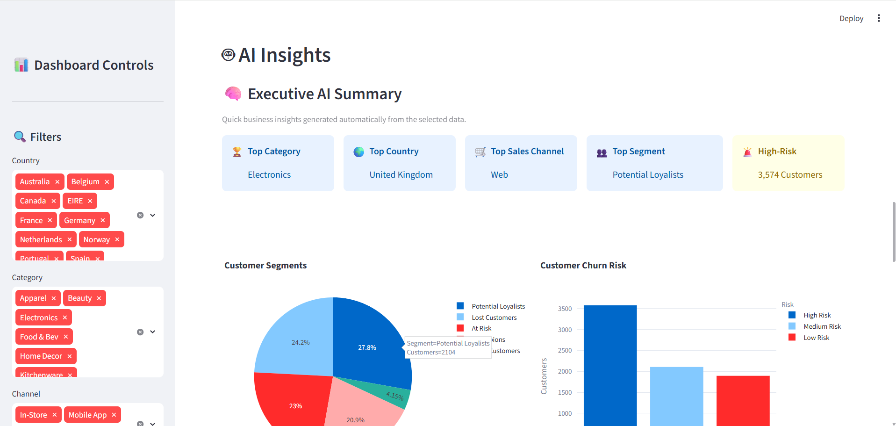
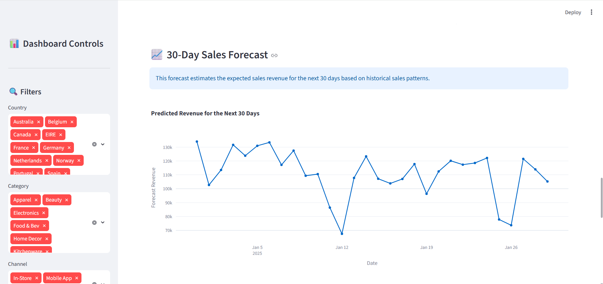
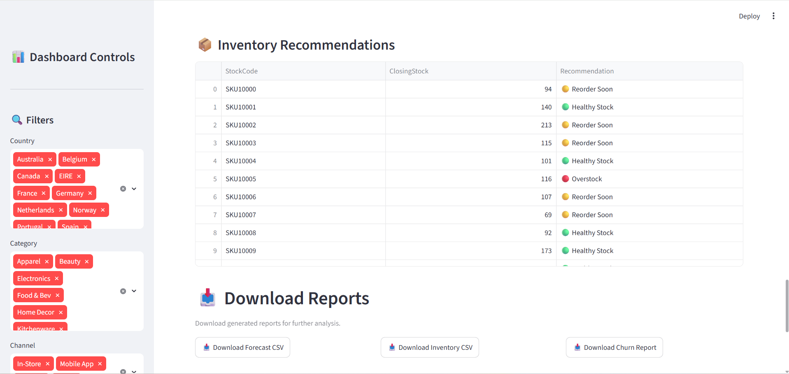
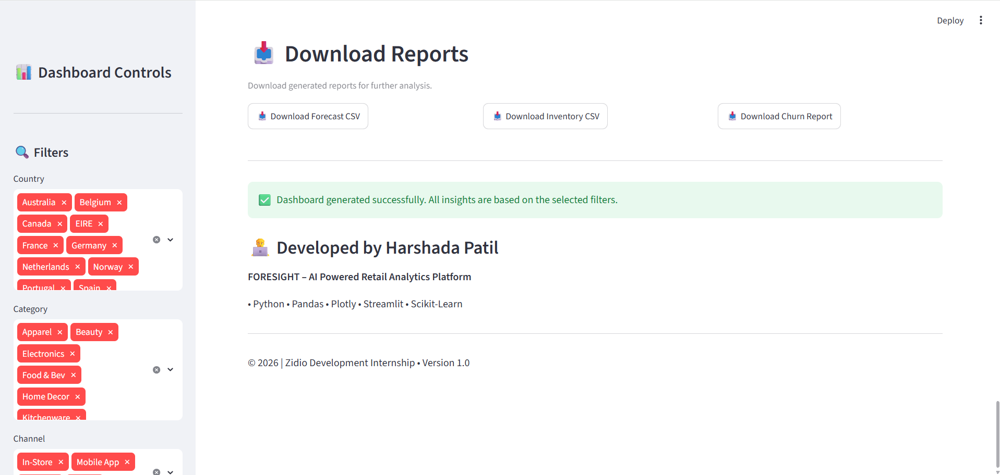

# 📊 FORESIGHT – AI-Powered Retail Analytics Dashboard




An end-to-end **AI-Powered Retail Analytics Dashboard** developed using **Python, Streamlit, Plotly, Pandas, and Machine Learning** during the **Zidio Development Internship**.

The platform enables businesses to analyze sales performance, forecast future demand, optimize inventory, identify customer segments, and detect customer churn through interactive visualizations and intelligent analytics.

---

# 🌐 Live Demo

👉 **https://foresight-ai-dashboard.streamlit.app/**

---

# 📂 GitHub Repository

👉 **https://github.com/harshada-codes/FORESIGHT**

---

# 📚 Table of Contents

- Features
- Technologies Used
- Project Structure
- Dashboard Overview
- Machine Learning Modules
- Installation
- Dashboard Screenshots
- Future Enhancements
- Author

---

# 🚀 Features

## 📈 Sales Analytics

- Monthly Revenue Trend
- Top 10 Products by Revenue
- Revenue by Category
- Revenue by Country
- Sales Channel Distribution
- Daily Sales Trend
- Quantity Analysis

## 👥 Customer Analytics

- Top Customers
- RFM Customer Segmentation
- Customer Churn Risk Analysis
- Executive AI Summary

## 🤖 AI & Machine Learning

- Sales Demand Forecasting
- Inventory Recommendation Engine
- Customer Segmentation using RFM Analysis
- Feature Engineering Pipeline

## 📊 Interactive Dashboard

- Dynamic Sidebar Filters
- KPI Cards
- Interactive Plotly Charts
- Downloadable Reports (CSV)
- AI Business Insights

---

# 🛠 Technologies Used

- Python
- Pandas
- NumPy
- Plotly
- Streamlit
- Scikit-Learn
- Random Forest Regressor
- Machine Learning
- Data Visualization

---

# 📁 Project Structure

```
FORESIGHT/
│
├── app/
│   └── app.py
│
├── data/
│   ├── raw/
│   └── processed/
│
├── outputs/
│   ├── forecast.csv
│   ├── inventory_recommendations.csv
│   └── customer_churn_risk.csv
│
├── src/
│   ├── 01_load_data.py
│   ├── 02_understand_data.py
│   ├── 03_data_quality.py
│   ├── 04_clean_data.py
│   ├── 05_eda_sales_overview.py
│   ├── 06_top_products.py
│   ├── 07_category_analysis.py
│   ├── 08_country_analysis.py
│   ├── 09_channel_analysis.py
│   ├── 10_top_customers.py
│   ├── 11_daily_sales_trend.py
│   ├── 12_quantity_analysis.py
│   ├── 13_correlation_heatmap.py
│   ├── 14_feature_engineering.py
│   ├── 15_rfm_segmentation.py
│   ├── forecasting.py
│   ├── inventory.py
│   ├── churn.py
│   └── data_loader.py
│
├── requirements.txt
├── runtime.txt
├── README.md
└── .gitignore
```

---

# 📊 Dashboard Overview

The dashboard provides:

- 📌 Executive KPI Cards
- 📈 Monthly Revenue Trend
- 🏆 Top Products Analysis
- 🛍 Revenue by Category
- 🌍 Revenue by Country
- 📱 Sales Channel Distribution
- 🤖 Executive AI Summary
- 👥 Customer Segmentation
- 🚨 Customer Churn Risk Analysis
- 📈 30-Day Sales Forecast
- 📦 Inventory Recommendations
- 📥 Downloadable Reports

---

# 🧠 Machine Learning Modules

## 📈 Demand Forecasting

**Model Used:** Random Forest Regressor

Predicts future sales revenue using historical sales data and engineered features.

---

## 👥 Customer Segmentation

Uses **RFM (Recency, Frequency, Monetary)** Analysis to classify customers into:

- Champions
- Loyal Customers
- Potential Loyalists
- At Risk
- Lost Customers

---

## 🚨 Customer Churn Risk

Identifies customers based on churn probability and classifies them into:

- High Risk
- Medium Risk
- Low Risk

---

## 📦 Inventory Recommendation

Provides intelligent inventory recommendations such as:

- 🟢 Healthy Stock
- 🟡 Reorder Soon
- 🔴 Overstock

---

# ▶️ Installation

Clone the repository

```bash
git clone https://github.com/harshada-codes/FORESIGHT.git
```

Navigate into the project

```bash
cd FORESIGHT
```

Create a virtual environment

```bash
python -m venv venv
```

Activate the virtual environment

### Windows

```bash
venv\Scripts\activate
```

Install dependencies

```bash
pip install -r requirements.txt
```

Run the application

```bash
streamlit run app/app.py
```

---

# 📷 Dashboard Screenshots

## 🏠 Dashboard Overview


---

## 📈 Monthly Revenue Trend



---

## 🏆 Top Products by Revenue



---

## 🌍 Revenue by Category & Country



---

## 🛒 Sales Channel Distribution



---

## 🤖 Executive AI Summary



---

## 📅 30-Day Sales Forecast



---

## 📦 Inventory Recommendations



---

## 📥 Download Reports



---

# 👩‍💻 Author

## Harshada Patil

### Skills

- Python
- Machine Learning
- Data Analytics
- Streamlit
- Plotly
- Pandas
- Scikit-Learn
- Business Intelligence

---

# 📄 License

This project was developed for educational purposes as part of the **Zidio Development Internship**.

© 2026 Harshada Patil